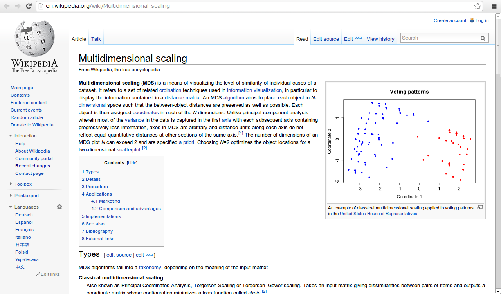
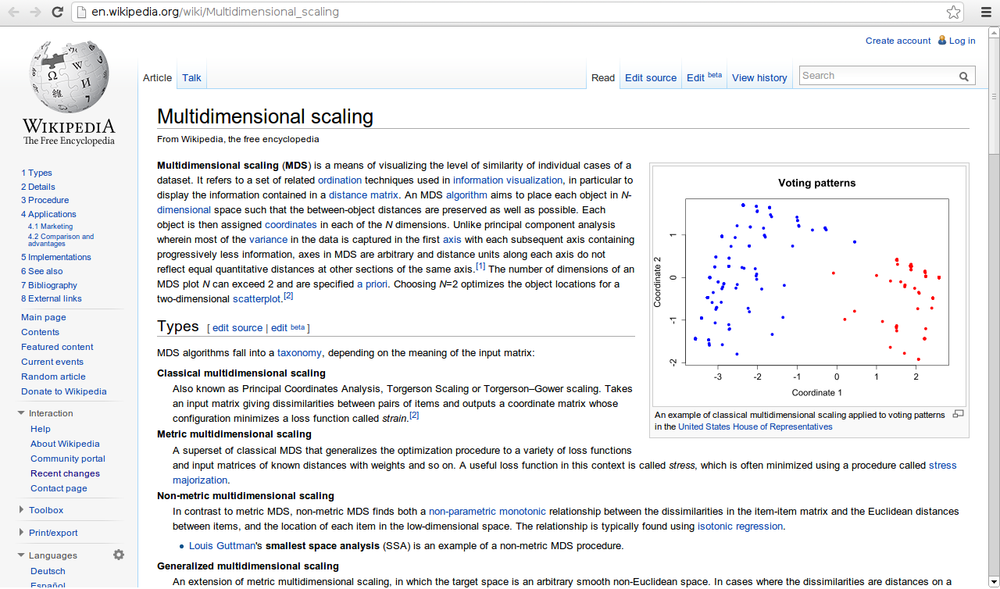
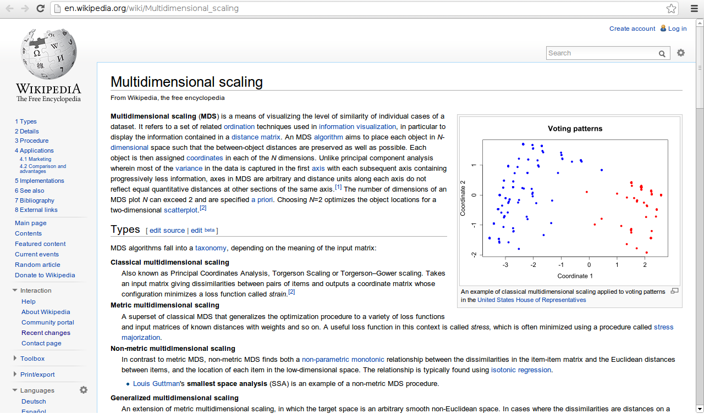

wikipedia
=========

a better wikipedia article navigation system

the proposed changes 

Apparently this is just a suggestion and nothing more.
I believe wikipedia has done extensive research to end up with the current design
But it's always nice to have alternatives :)

actually it cat get even simpler, check the after2.png

